# Car-Repair-Shop-Sales-Analysis

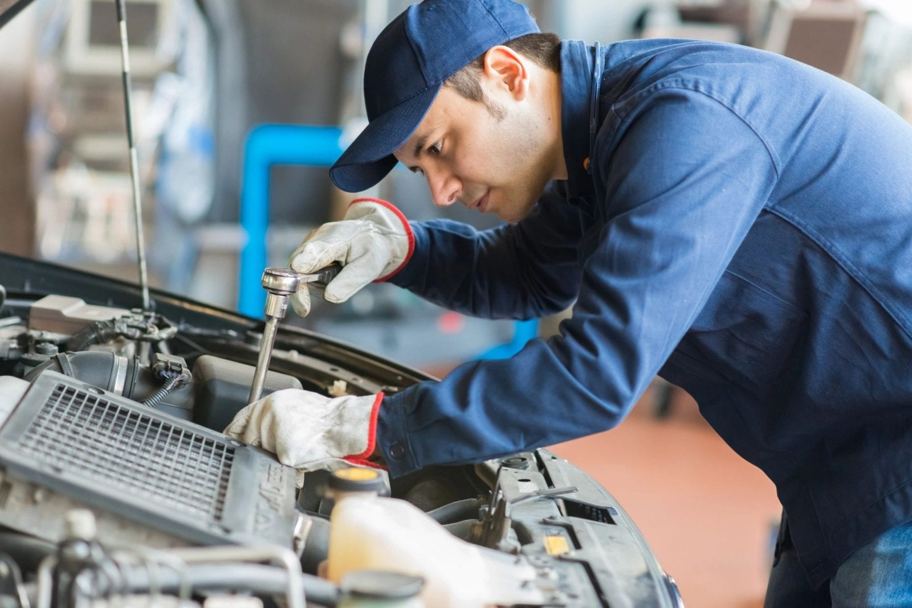
---

## Database Setup

The screenshot below contains the result of the relational database containing the imported data from the CSV files.
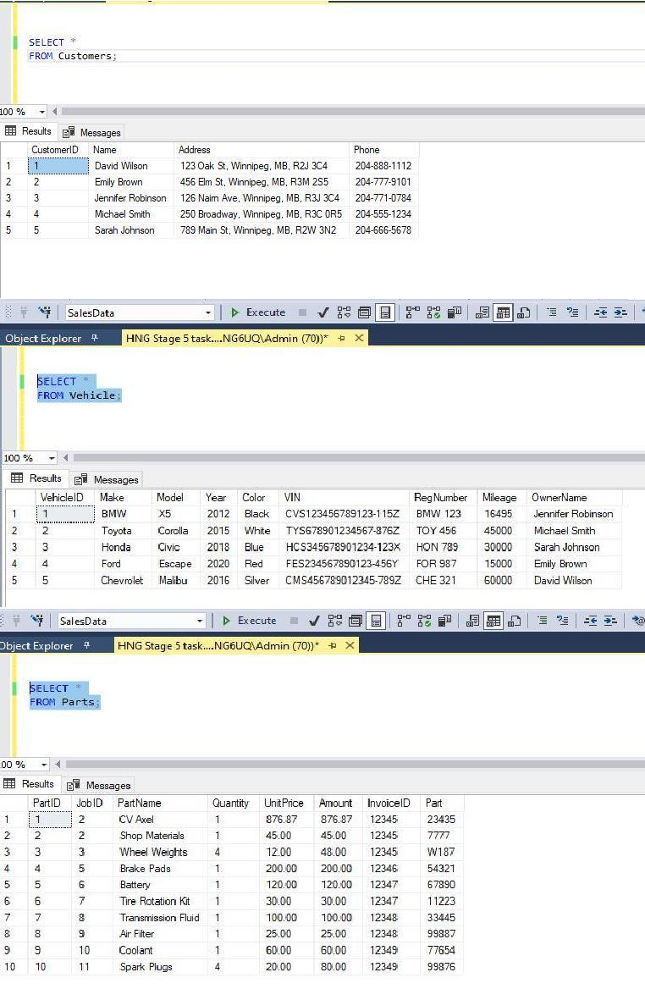
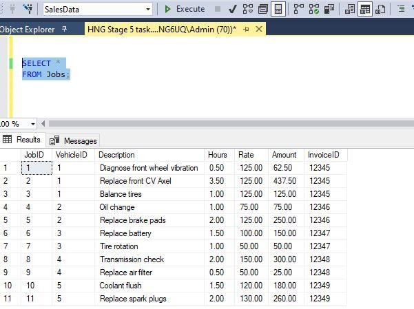
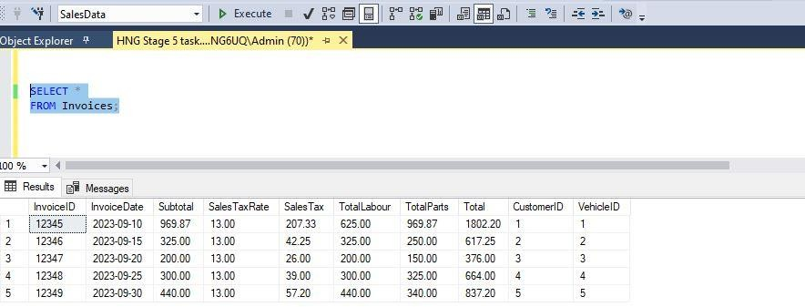

# Analysis Report

## Introduction

The objective of this analysis is to gain insights into customer behaviors and spending patterns. By examining customer data, the aim is to identify the top customers by spending, calculate the average customer spending, and analyze the frequency of customer visits. These insights will help in making informed business decisions and improving customer relationship management.

## Customer Analysis

### - Top 5 Customers by Spending
The following result shows the top 5 customers based on their total spending on vehicle repairs and parts.
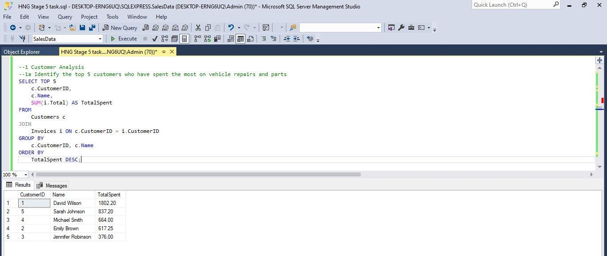
These customers represent the highest spenders and are crucial to the business's revenue.

### - Average Customer Spending
The average spending of customers on repairs and parts is calculated as follows
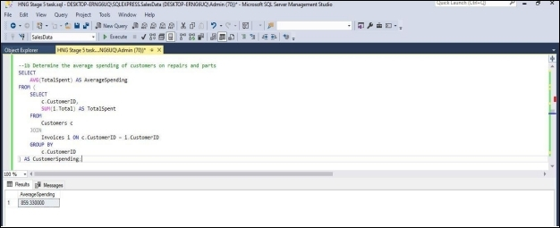
Average Spending = $859.33
This average provides a benchmark to assess individual customer spending against the overall customer base.

### - Frequency of Customer Visits
The frequency of customer visits helps in understanding customer engagement and loyalty. The query result below shows the number of visits for each customer:
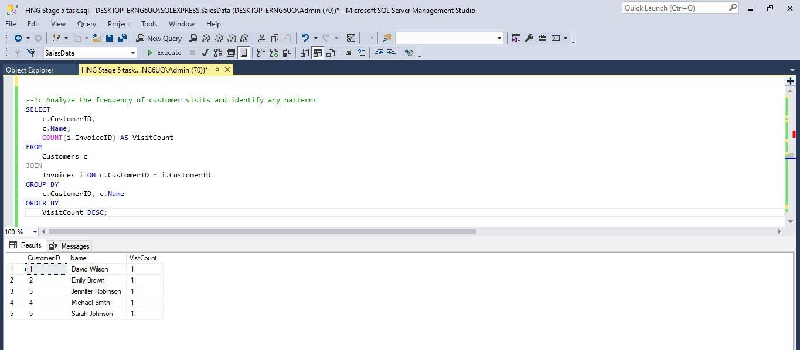
Each customer in this sample has visited once, indicating either a lack of repeat visits within the dataset or a need for more comprehensive data collection.

### Visualization
These visuals illustrate key findings from my analysis.
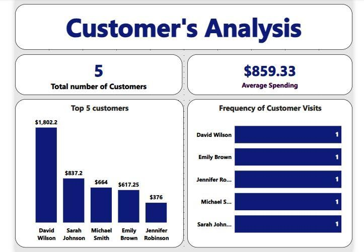

## Vehicle Analysis

### - Average mileage of serviced vehicles
The average mileage of vehicles that were brought in for service is 33,299. This indicates the typical usage level of vehicles serviced by the company.
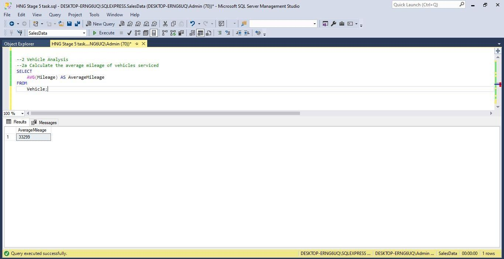

### - Most Common Vehicle Makes and Models Brought in for Service
The query result below shows the most common vehicle makes and models brought in for service
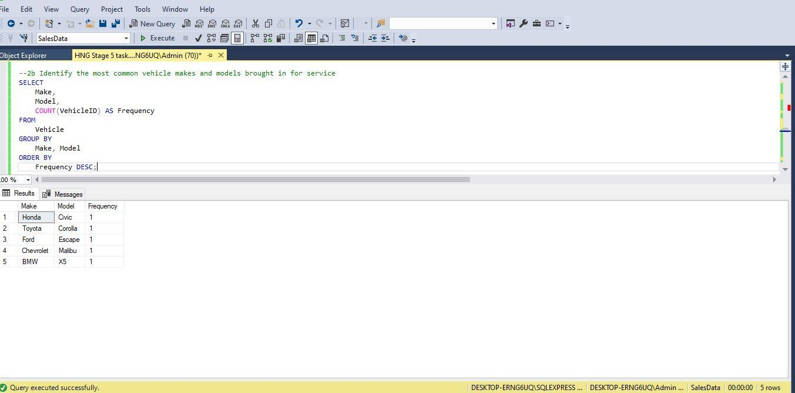
This shows a diverse range of vehicle makes and models, each with a frequency of 1 in the service records provided.

### - Distribution of Vehicle Ages
The distribution of vehicle ages, based on the year of manufacture, is shown below;
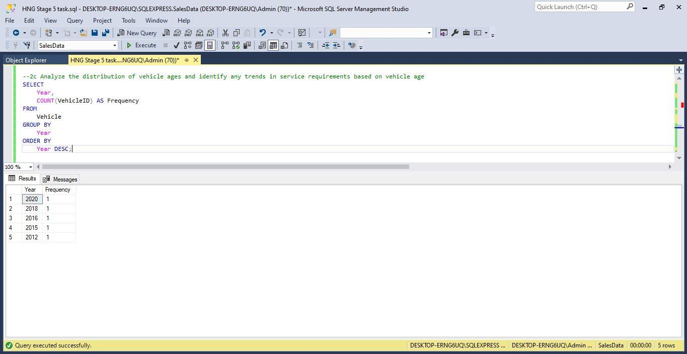
The distribution indicates fairly even spread of vehicle ages ranging from 2012 to 2020. This suggests that vehicles of varying ages are serviced, with no particular trend favoring newer or older vehicles.

### Visualization
This illustrates key findings in the vehicle analysis.
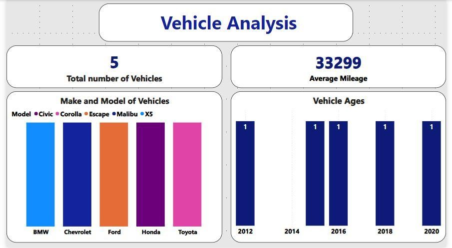

## Job Performance Analysis

### - Most Common Types of Jobs Performed and Their Frequency
The analysis of job frequencies reveals that each type of job recorded in the system has been performed only once. This suggests that the current dataset may either be limited or represent a summary of unique job types rather than repeated entries.
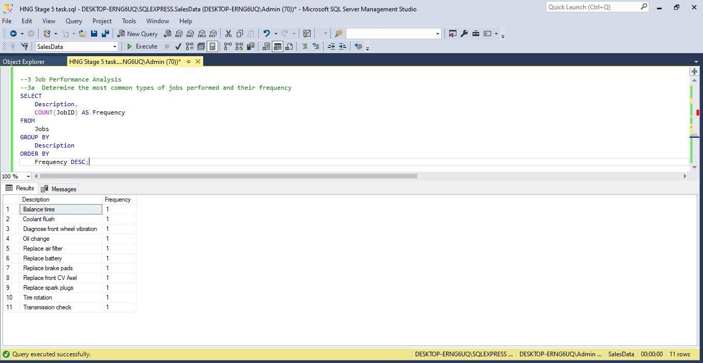

### - Total Revenue Generated from Each Type of Job
The total revenue generated by each type of job is calculated by summing the costs associated with each job type.
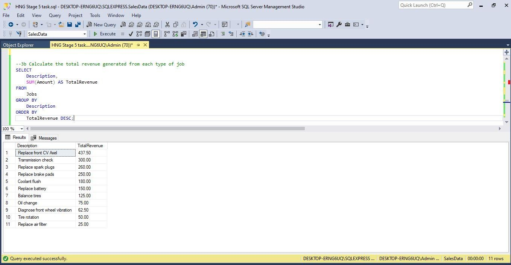

### - Jobs with the Highest and Lowest Average Costs
The average cost of each job type gives insight into the most and least expensive services provided. The jobs with the highest and lowest average costs are:
- Highest Average Cost Jobs:
  Replace front CV Axel: $437.50
  Transmission check: $300.00
  Replace spark plugs: $260.00
- Lowest Average Cost Jobs:
  Replace air filter: $25.00
  Tire rotation: $50.00
  Diagnose front wheel vibration: $62.50
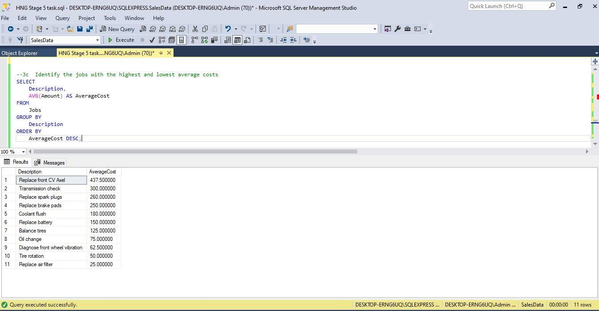

### Visualization
The visuals indicate key findings in the job performance analysis
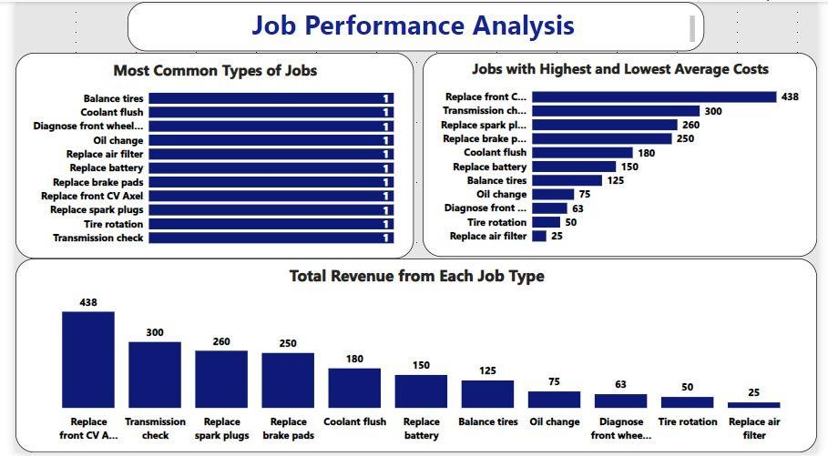

## Parts Usage Analysis

### - Top 5 Most Frequently Used Parts and Their Total Usage
This analysis identifies the top 5 parts used most frequently in repairs, providing insights into inventory and usage patterns.
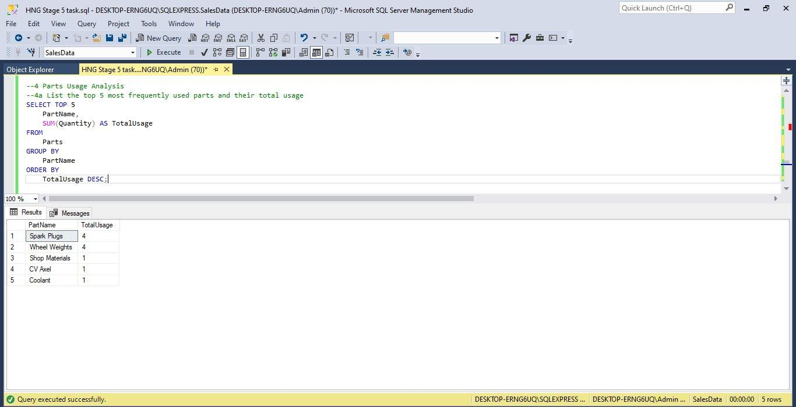
The above result highlights the most frequently used parts, with Spark Plugs and Wheel Weights leading in usage.

### - Average Cost of Parts Used in Repairs
To understand the cost implications of parts used in repairs, the average cost of these parts has been calculated.
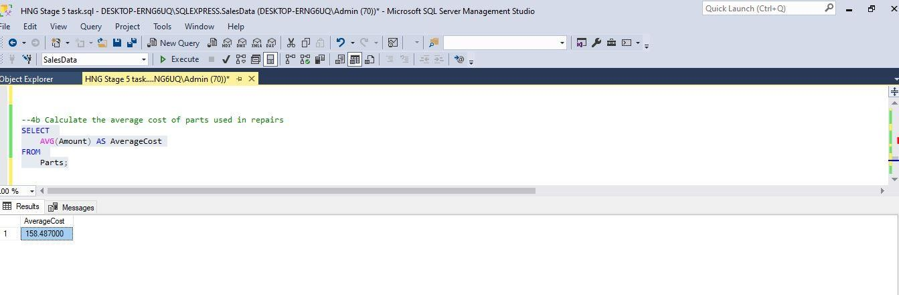
The average cost of parts used in repairs is approximately 158.497, providing a benchmark for cost management.

### - Total Revenue Generated from Parts Sales
This quantifies the total revenue generated from the sale of parts, reflecting the financial performance of parts sales.
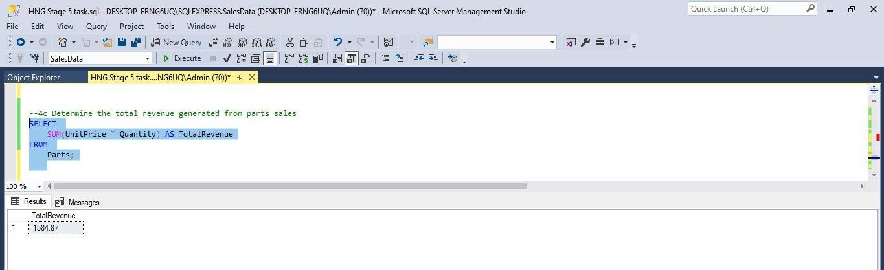
The total revenue generated from part sales amounts to 1584.87, indicating the contribution of parts sales to overall revenue.

### Visualization
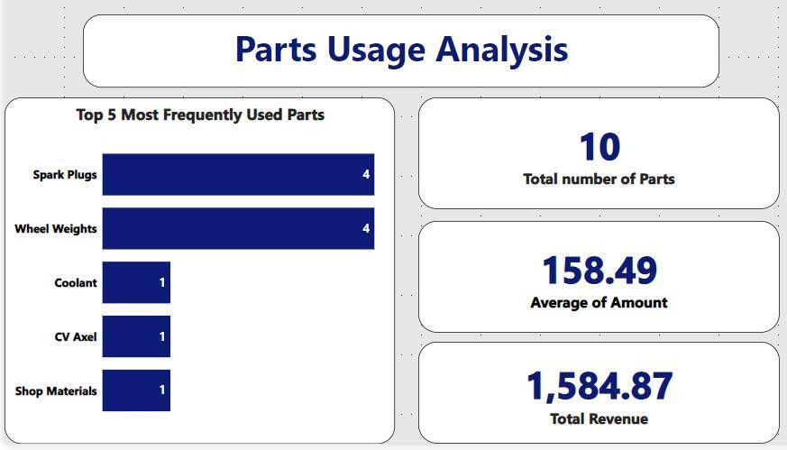

## 5.Financial Analysis

### - Monthly Revenue from Labor and Parts
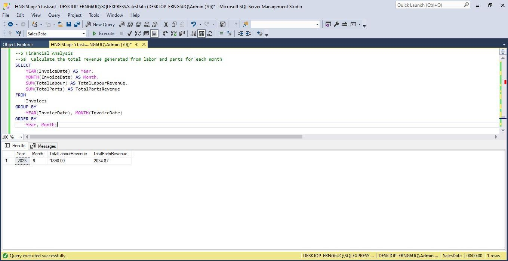
In September 2023, the repair shop generated $1,890.00 from labor services and $2,034.87 from parts, indicating a balanced income stream from both sources.

### - Overall Profitability of the Repair Shop
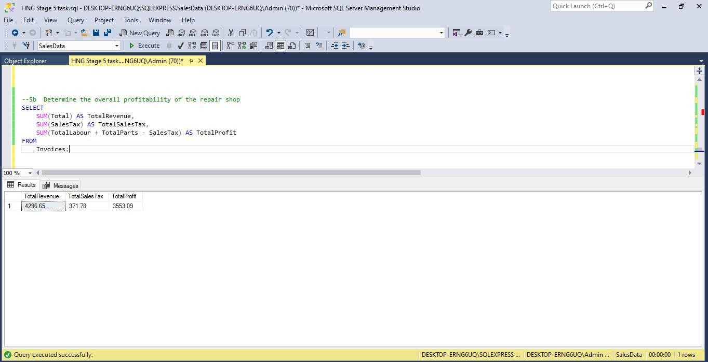
The repair shop generated a total revenue of $4,296.65, with $371.78 collected as sales tax. After accounting for the sales tax, the shop's overall profit stands at $3,553.09. This shows that the shop maintains a healthy profit margin after fulfilling tax obligations.

### - Impact of Sales Tax on Total Revenue
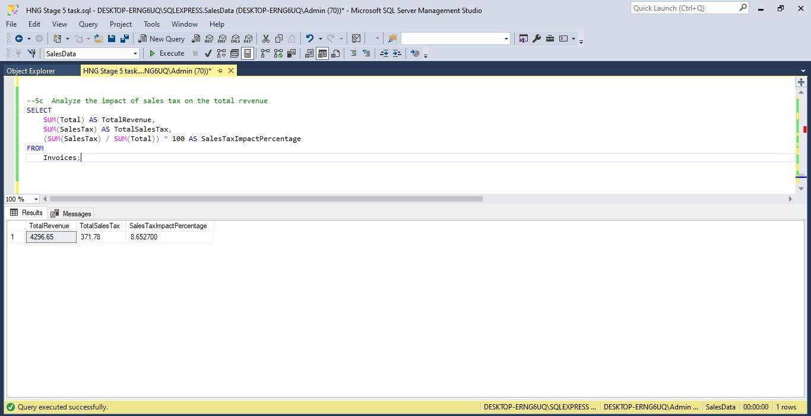
The sales tax constitutes approximately 8.65% of the total revenue. This analysis shows that a significant portion of the revenue is allocated to taxes, but the percentage remains within a manageable range for business operations.

### Visualization
This shows insights derived from my analysis
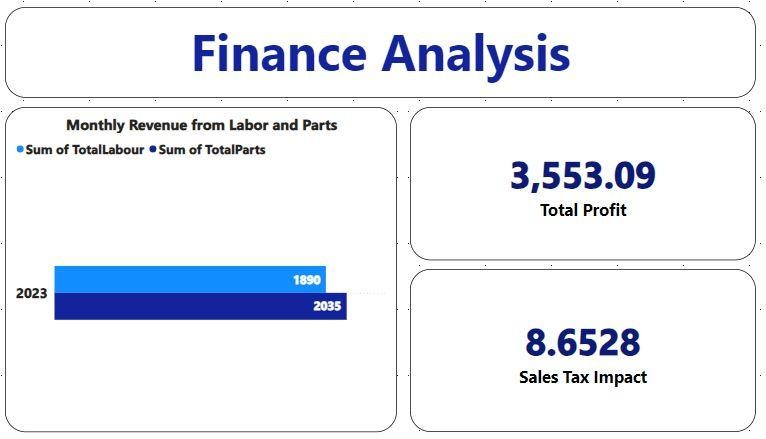

## Optimization Recommendations
### a) Boosting of underperforming services
- Enhance Marketing for Low-Frequency Jobs: Since all jobs were performed only once, increasing marketing efforts for services like "Tire Rotation" and "Oil Change" to drive more frequency should be considered.
- Review Pricing for High-Cost Services: The "Replace Front CV Axel" service has the highest average cost. Ensuring the pricing aligns with market standards and customer expectations to avoid pricing out potential clients.
- Focus on High-Revenue Services: Services such as "Replace Front CV Axel" and "Transmission Check" generate significant revenue. Promoting these high-value services through targeted campaigns can maximize profitability.
### b) Stocking Parts
- Stock High-Demand Parts: Increase inventory of Spark Plugs and Wheel Weights.
- Monitor Other Parts: Maintain moderate levels of Shop Materials, CV Axel, and Coolant.
- Reduce Costs: Explore bulk purchasing and supplier negotiations to lower costs.
- Regularly Review Inventory: Implement regular reviews to prevent stockouts and optimize reorder points.
### c)Suggested Loyalty Program Benefits
-Exclusive Discounts: Offer personalized discounts on services and parts.
-Points System: Implement a points-based system where customers earn points for each visit and spend, redeemable for future services.
-Priority Service: Provide priority booking and faster service times for loyalty members.
-Special Offers: Send targeted promotions and special offers based on past spending behavior.
By focusing on top customers, the business can enhance customer retention and increase overall revenue.
### d)Staff Scheduling:
- Flexible Scheduling: Allow for quick adjustments based on demand to reallocate staff as needed.
- Cross-Training: Train employees in multiple job types for efficient service management and flexibility.
- Continuous Monitoring: Regularly track job data to adjust staffing and shift allocations in line with demand trends.
These strategies aim to optimize staff utilization and adapt to varying workloads effectively.

